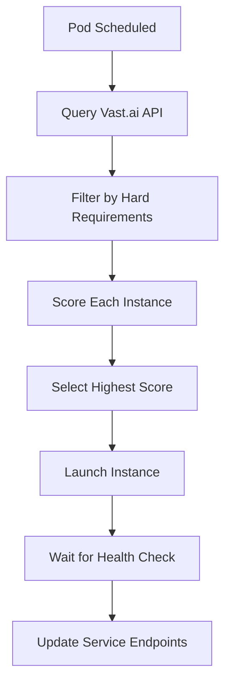

# Vast.ai API Key Setup & Instance Selection Guide

## 🔑 Getting Your Vast.ai API Key

### Step 1: Create Vast.ai Account
1. Go to [console.vast.ai](https://console.vast.ai/)
2. Sign up/Login with your account
3. Add payment method and verify account

### Step 2: Get Your API Key
1. Click on your profile (top-right corner)
2. Go to **"Account"** → **"API Keys"**
3. Click **"Create New API Key"**
4. Copy the generated key (starts with `vast_api_key_...`)

### Step 3: Add to Configuration
Edit your `config.env` file:
```bash
# Replace with your actual API key
VAST_API_KEY=vast_api_key_abcd1234567890
```

## ⚙️ Instance Selection Configuration

### How Virtual Kubelet Chooses Instances

The Virtual Kubelet uses a **smart scoring system** to select the best Vast.ai instance:

#### 1. **Hard Requirements** (Must Meet)
```yaml
# From config.env
VAST_GPU_TYPE=RTX3060           # Must have this GPU type
VAST_MIN_GPU_MEMORY=12          # Must have at least 12GB VRAM
VAST_MAX_PRICE_PER_HOUR=0.50    # Must be under $0.50/hour
VAST_RELIABILITY_SCORE=0.95     # Must have 95%+ reliability
```

#### 2. **Scoring Criteria** (Best Match Wins)
- **Price (30%)**: Lower cost = higher score
- **Performance (25%)**: Better speed/reliability = higher score
- **GPU Match (20%)**: Exact GPU type match = bonus points
- **Location (15%)**: Closer to your region = higher score
- **Availability (10%)**: Currently available = higher score

#### 3. **Selection Process**


## 🎯 Customizing Instance Selection

### Basic Configuration (config.env)
```bash
# GPU Preferences
VAST_GPU_TYPE=RTX3060           # RTX3060, RTX4090, A4000, A6000
VAST_MIN_GPU_MEMORY=12          # Minimum VRAM (GB)
VAST_MAX_PRICE_PER_HOUR=0.50    # Budget limit

# Performance Requirements  
VAST_MIN_DOWNLOAD_SPEED=100     # Minimum internet speed (Mbps)
VAST_RELIABILITY_SCORE=0.95     # Minimum host reliability

# Location Preferences
VAST_DATACENTER_LOCATION=US     # US, EU, ASIA
```

### Advanced Configuration (k8s/vast-gpu/vast-provider-config.yaml)
```yaml
# Multiple GPU type preferences (ordered)
gpu:
  preferred_types:
    - "RTX3060"     # First choice (budget)
    - "RTX4090"     # Second choice (performance)
    - "A4000"       # Third choice (professional)

# Location preferences (ordered by latency)
locations:
  - "US-CA"        # California (lowest latency)
  - "US-TX"        # Texas
  - "US-NY"        # New York
  - "US"           # Any US location
  - "EU"           # European fallback
```

## 💰 Cost Optimization Examples

### Budget Configuration
```bash
# Target: $0.15-0.25/hour for RTX 3060
VAST_GPU_TYPE=RTX3060
VAST_MAX_PRICE_PER_HOUR=0.30
VAST_RELIABILITY_SCORE=0.90    # Slightly lower for better price
```

### Performance Configuration  
```bash
# Target: $0.40-0.60/hour for RTX 4090
VAST_GPU_TYPE=RTX4090
VAST_MAX_PRICE_PER_HOUR=0.70
VAST_MIN_DOWNLOAD_SPEED=200    # Higher speed requirement
VAST_RELIABILITY_SCORE=0.98    # Premium reliability
```

### Development Configuration
```bash
# Target: Cheapest available for testing
VAST_GPU_TYPE=GTX1080Ti
VAST_MIN_GPU_MEMORY=8
VAST_MAX_PRICE_PER_HOUR=0.15
VAST_RELIABILITY_SCORE=0.80    # Lower requirements OK for dev
```

## 📊 Real-Time Instance Selection

### How It Works in Practice

1. **Pod Scheduling**: Kubernetes schedules GPU pod to `vast-gpu-node-1`
2. **API Query**: Virtual Kubelet calls Vast.ai `/instances/search` API
3. **Filtering**: Removes instances that don't meet hard requirements
4. **Scoring**: Ranks remaining instances by weighted criteria
5. **Selection**: Chooses highest-scoring available instance
6. **Launch**: Creates instance with your multi-service container
7. **Health Check**: Waits for both STT and TTS services to be healthy
8. **Endpoint Update**: Updates Kubernetes service endpoints with external IP:port

### Example Selection Log
```
[VAST] Searching for instances matching: RTX3060, 12GB+, <$0.50/hr
[VAST] Found 23 candidates, filtering...
[VAST] After filtering: 8 instances remain
[VAST] Scoring instances:
  - Instance 12345: Score 0.87 (RTX3060, $0.22/hr, US-CA, 98.2% reliability)
  - Instance 12346: Score 0.83 (RTX3060, $0.19/hr, US-TX, 96.8% reliability)
  - Instance 12347: Score 0.81 (RTX3060, $0.25/hr, EU-DE, 99.1% reliability)
[VAST] Selected instance 12345 - launching...
[VAST] Instance ready, updating service endpoints:
  - june-stt.default.svc.cluster.local:8001 → 203.0.113.45:42352
  - june-tts.default.svc.cluster.local:8000 → 203.0.113.45:42351
```

## 🔧 Troubleshooting Selection Issues

### No Instances Found
```bash
# Check if requirements are too strict
kubectl logs -n kube-system deployment/virtual-kubelet-vast

# Common issues:
# 1. Price too low (increase VAST_MAX_PRICE_PER_HOUR)
# 2. GPU memory too high (decrease VAST_MIN_GPU_MEMORY)
# 3. Reliability too strict (decrease VAST_RELIABILITY_SCORE)
```

### Instance Selection Too Slow
```bash
# Optimize selection criteria in vast-provider-config.yaml
# 1. Increase max_price_per_hour for more options
# 2. Add more GPU types to preferred_types
# 3. Expand location preferences
```

### Wrong Instance Type Selected
```bash
# Check scoring weights in vast-selection-weights ConfigMap
# Increase gpu_match weight if GPU type is most important
# Increase price weight if cost is most important
```

## 🎛️ Quick Configuration Templates

### Copy and paste into your `config.env`:

**Budget Template** (RTX 3060, ~$0.20/hr):
```bash
VAST_GPU_TYPE=RTX3060
VAST_MAX_PRICE_PER_HOUR=0.35
VAST_RELIABILITY_SCORE=0.90
VAST_DATACENTER_LOCATION=US
```

**Performance Template** (RTX 4090, ~$0.50/hr):
```bash
VAST_GPU_TYPE=RTX4090
VAST_MAX_PRICE_PER_HOUR=0.70
VAST_MIN_DOWNLOAD_SPEED=200
VAST_RELIABILITY_SCORE=0.98
VAST_DATACENTER_LOCATION=US
```

**Development Template** (Any GPU, cheapest):
```bash
VAST_GPU_TYPE=GTX1080Ti
VAST_MIN_GPU_MEMORY=8
VAST_MAX_PRICE_PER_HOUR=0.20
VAST_RELIABILITY_SCORE=0.80
VAST_DATACENTER_LOCATION=US
```